# PETSc, MPI, and Kokkos Parallelization Plan

## Current State
Frehg2 currently uses PETSc, MPI, and Kokkos in the build, but the SWE and RE linear solvers are still structurally serial:

- [`src/swe/SweSolver.cpp`](src/swe/SweSolver.cpp) creates `MatCreateSeqAIJ(PETSC_COMM_SELF, ...)`, sequential vectors, and a sequential `KSP` for the semi-implicit SWE system.
- [`src/re/ReSolver.cpp`](src/re/ReSolver.cpp) creates `MatCreate(PETSC_COMM_SELF, ...)`, `MatSeqAIJSetPreallocation(...)`, sequential vectors, and uses `KSPPREONLY + PCLU` for RE.
- [`src/swe/SweSolver.hpp`](src/swe/SweSolver.hpp) and [`src/re/ReSolver.hpp`](src/re/ReSolver.hpp) expose host-side `std::vector` linear-system containers, which makes GPU execution and distributed assembly expensive.
- [`CMakeLists.txt`](CMakeLists.txt) already enables `USE_KOKKOS`, `USE_MPI`, and `USE_PETSC`, so the plan should preserve those options and extend the implementation behind them.

The target design is PETSc-owned distributed linear algebra, with Kokkos used for local coefficient/state loops and optional device-resident assembly. PETSc should own the global matrix/vector/KSP lifecycle; Frehg2 should provide local stencil coefficients and boundary/mask logic.

```mermaid
flowchart LR
    Config[ConfigAndGrid] --> DMDA[PETScDMDA]
    DMDA --> LocalViews[LocalOwnedAndGhostedViews]
    LocalViews --> KokkosLoops[KokkosCoefficientLoops]
    KokkosLoops --> PETScMat[DistributedPETScMatrix]
    PETScMat --> KSP[PETScKSPPreconditioner]
    KSP --> StateUpdate[KokkosStateUpdateLoops]
    StateUpdate --> Output[HDF5AndDiagnostics]
```

## Design Principles
- Preserve the validated numerical algorithms first. The parallelization should initially reproduce current serial Frehg2 results before changing physical formulations.
- Use PETSc `DMDA` for structured SWE and RE grids, with active masks for NODATA irregular domains.
- Keep active-cell compression as a later optimization, not the first implementation path.
- Prefer runtime PETSc options over hard-coded solver choices.
- Reuse PETSc `Mat`, `Vec`, `KSP`, and `DM` objects across timesteps where sparsity pattern is fixed.
- Treat GPU support as a backend choice after MPI/distributed ownership is correct.
- Move non-linear-solver loops to Kokkos incrementally and verify each move against host results.

## Phase 1: PETSc Solver Abstraction Layer
Create a small PETSc infrastructure layer instead of embedding PETSc object creation directly inside solver methods.

Candidate files:
- Add [`src/linear/PetscDmda.hpp`](src/linear/PetscDmda.hpp)
- Add [`src/linear/PetscDmda.cpp`](src/linear/PetscDmda.cpp)
- Add [`src/linear/PetscLinearSolver.hpp`](src/linear/PetscLinearSolver.hpp)
- Add [`src/linear/PetscLinearSolver.cpp`](src/linear/PetscLinearSolver.cpp)
- Update [`src/CMakeLists.txt`](src/CMakeLists.txt)

Responsibilities:
- Own `DM`, `Mat`, `Vec`, `KSP`, and local/global vectors.
- Provide 2D DMDA creation for SWE and 3D DMDA creation for RE.
- Provide local ownership ranges and global indexing helpers.
- Provide a runtime-option path for `KSPSetFromOptions`.
- Provide RAII cleanup for PETSc objects.
- Expose local row assembly methods that accept stencil coefficients.

Initial PETSc object strategy:
- SWE: `DMDACreate2d`, star stencil, width 1, one degree of freedom.
- RE: `DMDACreate3d`, star stencil, width 1, one degree of freedom.
- Use `DMCreateMatrix(dm, &A)` for stencil-aware preallocation.
- Use `DMCreateGlobalVector(dm, &b)` and `VecDuplicate(b, &x)`.

Acceptance tests:
- New unit test: `tests/linear/test_petsc_dmda_2d.cpp`
  - Create a tiny 4x3 DMDA with MPI.
  - Verify global size, local ownership, ghost width, and global-to-local vector exchange.
- New unit test: `tests/linear/test_petsc_dmda_3d.cpp`
  - Create a tiny 3x2x4 DMDA with MPI.
  - Verify ownership ranges cover all global cells exactly once.
- Run with one and multiple ranks:
  - `ctest -R frehg2_petsc_dmda_2d_tests`
  - `mpiexec -n 2 ./tests/linear/frehg2_petsc_dmda_2d_tests`
  - `mpiexec -n 2 ./tests/linear/frehg2_petsc_dmda_3d_tests`

## Phase 2: Active Mask and NODATA Semantics Under DMDA
Support irregular domains by keeping a rectangular DMDA and an active mask. This is the safest first implementation for raster DEM NODATA.

Implementation details:
- Store `active` as a DMDA-compatible local/global vector or Kokkos mirror-backed array.
- Every rank must know the active status of ghost neighbors before assembly.
- For inactive cells, insert identity rows:
  - `A(i,i) = 1`
  - `b(i) = 0`
- For active cells with inactive neighbors, apply the physical boundary condition on that face instead of inserting a neighbor coefficient.
- Keep inactive cells out of monitoring and output statistics, but preserve rectangular output ordering for compatibility.

Tests:
- New test: `tests/linear/test_dmda_active_mask.cpp`
  - 5x5 grid with center inactive cell.
  - Verify inactive row is identity.
  - Verify active neighbors do not reference inactive unknowns.
- New SWE matrix test:
  - 5x5 DEM with NODATA notch.
  - Compare serial matrix coefficients to DMDA assembly on one rank.
  - Run on two ranks and compare solution against one-rank result.
- New RE matrix test:
  - 4x3x3 grid with a vertical inactive column.
  - Verify no horizontal/vertical coefficient enters inactive cells.

## Phase 3: MPI-Distributed SWE DMDA Solver
Replace the current sequential SWE PETSc path with distributed DMDA assembly.

Current code to replace:
- [`src/swe/SweSolver.cpp`](src/swe/SweSolver.cpp) `solveLinearSystem(const SweLinearSystem&)`
- Eventually replace or bypass `SweLinearSystem` and `SweMatrixEntry` host assembly for production.

Implementation steps:
- Keep the existing serial implementation behind a compatibility option for early comparison.
- Add a new SWE DMDA path that assembles local rows directly from local/ghosted state.
- Reuse matrix/vector/KSP objects across timesteps.
- Assemble only owned rows on each MPI rank.
- Use `MatSetValuesStencil` or global row indices from DMDA ownership.
- Use `VecSetValuesStencil` or direct local/global vector access for RHS.
- Gather the solution back into the current `LegacySweState` only as an intermediate compatibility step.

Recommended default solver options:
- Initial CPU validation:
  - `-ksp_type cg`
  - `-pc_type gamg`
  - `-ksp_rtol 1e-8`
- Fallback/debug:
  - `-ksp_type cg -pc_type jacobi`
  - `-ksp_monitor_short`

Tests:
- Existing `frehg2_1d_swe_matrix_tests` must still pass.
- Add `tests/swe/test_swe_dmda_matrix.cpp`:
  - Compare serial matrix coefficients to DMDA matrix values on one rank for a deterministic 10-cell channel.
- Add `tests/swe/test_swe_dmda_mpi_equivalence.cpp`:
  - Run the same 2D surface case on 1 rank and 2 ranks.
  - Compare `eta`, `depth`, and outlet discharge with tolerance `1e-10` for tiny deterministic tests.
- Benchmark validation:
  - Run b1 and b4 on 1 rank and 2 ranks.
  - Compare output L2 differences between rank counts.
  - Compare b4 area-normalized discharge with reference.

## Phase 4: MPI-Distributed RE DMDA Solver
Replace the current sequential RE PETSc path with distributed 3D DMDA assembly.

Current code to replace:
- [`src/re/ReSolver.cpp`](src/re/ReSolver.cpp) `solveLinearSystem(const ReLinearSystem&)`
- Eventually bypass `ReLinearSystem` host assembly for production.

Implementation steps:
- Create a 3D DMDA with stencil width 1.
- Assemble 7-point stencil rows for owned active cells.
- Apply top/bottom/lateral BCs at physical and NODATA boundaries.
- Use ghosted local vectors for `h`, `wc`, `soil_id`, `dz3d`, conductivity faces, and active mask.
- Keep soil table uniform across ranks; distribute only per-cell `soil_id`.
- Replace direct LU default with scalable iterative defaults.

Recommended solver options:
- If matrix remains SPD:
  - `-ksp_type cg -pc_type gamg -ksp_rtol 1e-8`
- If nonsymmetry appears from boundary or nonlinear terms:
  - `-ksp_type gmres -pc_type gamg -ksp_rtol 1e-8`
- Alternative CPU/GPU-capable AMG if PETSc was built with hypre:
  - `-ksp_type gmres -pc_type hypre -pc_hypre_type boomeramg`
- Avoid `KSPPREONLY + PCLU` except for tiny tests.

Tests:
- Existing `frehg2_1d_re_column_tests`, `frehg2_re_matrix_tests`, and `frehg2_soil_map_tests` must pass.
- Add `tests/re/test_re_dmda_matrix.cpp`:
  - Compare serial 1D column and small 3D matrix coefficients to DMDA assembly on one rank.
- Add `tests/re/test_re_dmda_mpi_equivalence.cpp`:
  - Same small 3D heterogeneous soil case on 1 and 2 ranks.
  - Compare head/water-content fields.
- Benchmark validation:
  - Run b2 and b3 on 1 and 2 ranks.
  - Verify rank-count invariant outputs within tolerance.
  - For Part 1-style validation, preserve legacy L2 targets where applicable.

## Phase 5: Kokkos-Parallel Local Physics and Assembly Loops
Move loops outside the linear solver to Kokkos. This should be independent of whether PETSc solves on CPU or GPU.

Target SWE loops in [`src/swe/SweSolver.cpp`](src/swe/SweSolver.cpp):
- depth/subgrid updates
- drag coefficient update
- momentum source update
- rainfall/evaporation update
- velocity update
- flux and CFL diagnostics
- local stencil coefficient assembly

Target RE loops in [`src/re/ReSolver.cpp`](src/re/ReSolver.cpp):
- water-content/head constitutive conversions
- conductivity face computation
- predictor coefficient assembly
- Darcy flux computation
- water-content update
- adaptive timestep diagnostics

Implementation guidelines:
- Convert state arrays from `std::vector` to Kokkos views incrementally or introduce device mirrors while preserving host output compatibility.
- Avoid capturing class members directly in `KOKKOS_LAMBDA`; copy needed values to locals.
- Fence only where host reads or PETSc insertion requires completed data.
- Keep tests comparing host loop and Kokkos loop results during transition.

Tests:
- Add per-loop deterministic tests for Kokkos vs host values.
- Extend existing SWE source/sink tests to run with Kokkos execution enabled.
- Extend RE soil/conductivity tests to compare Kokkos-computed faces and fluxes.
- Run with CPU Kokkos backend first, then GPU backend when available.

## Phase 6: Single-GPU PETSc Backend
Enable one-rank GPU PETSc solves. This gives GPU parallelism even without multi-GPU MPI.

Prerequisites:
- PETSc must be built with a GPU backend.
- For CUDA:
  - `-vec_type cuda`
  - `-mat_type aijcusparse`
- For HIP:
  - `-vec_type hip`
  - `-mat_type aijhipsparse`
- For Kokkos PETSc backend:
  - `-vec_type kokkos`
  - `-mat_type aijkokkos`

Implementation steps:
- Ensure Frehg2 does not force CPU-only PETSc types.
- Keep `MatSetFromOptions`, `VecSetFromOptions`, and `KSPSetFromOptions` active.
- Reuse matrices/vectors to reduce CPU-GPU transfer overhead.
- Prefer matrix-free or device-side coefficient staging only after DMDA correctness is established.
- Add runtime logging of PETSc matrix/vector types to the simulation summary.

Recommended GPU preconditioners:
- First-choice general AMG:
  - `-ksp_type cg -pc_type gamg` for SPD systems.
  - `-ksp_type gmres -pc_type gamg` for nonsymmetric systems.
- If PETSc/hypre GPU support is available:
  - `-ksp_type gmres -pc_type hypre -pc_hypre_type boomeramg`
- Simple debug baseline:
  - `-ksp_type cg -pc_type jacobi`
- Avoid SOR and sequential LU as production GPU choices.

Single-GPU run examples:
- CUDA:
  - `mpiexec -n 1 ./frehg2 case.yaml -vec_type cuda -mat_type aijcusparse -ksp_type cg -pc_type gamg`
- Kokkos:
  - `mpiexec -n 1 ./frehg2 case.yaml -vec_type kokkos -mat_type aijkokkos -ksp_type cg -pc_type gamg`

Tests:
- Add CTest labels for GPU tests but keep them optional.
- GPU smoke test: tiny SWE DMDA solve comparing CPU and GPU results.
- GPU smoke test: tiny RE DMDA solve comparing CPU and GPU results.
- Benchmark smoke: b1/b2 on single GPU if available.
- Check PETSc reports GPU matrix/vector types in log output.

## Phase 7: CPU MPI and Hybrid MPI plus OpenMP/Kokkos
Use MPI as the primary CPU scaling mechanism. Use OpenMP through Kokkos for local loops and possibly PETSc kernels where supported.

Recommended CPU runtime modes:
- MPI only:
  - `mpiexec -n 8 ./frehg2 case.yaml -ksp_type cg -pc_type gamg`
- Hybrid MPI plus OpenMP/Kokkos:
  - `export OMP_NUM_THREADS=4`
  - `export OMP_PROC_BIND=spread`
  - `export OMP_PLACES=cores`
  - `mpiexec -n 4 ./frehg2 case.yaml -ksp_type cg -pc_type gamg`

Implementation steps:
- Use Kokkos execution policies over local owned ranges.
- Avoid nested OpenMP inside PETSc unless PETSc build and runtime are known to benefit.
- Add runtime summary fields for MPI ranks, OpenMP threads, Kokkos execution space, and PETSc KSP/PC choices.

Tests:
- Weak scaling smoke: same cells per rank, 1/2/4 ranks.
- Strong scaling smoke: fixed b4 and b3 sizes over 1/2/4 ranks.
- Compare solution invariance across MPI-only and hybrid runs.
- Record runtime breakdown from `simulation_summary.txt` for solver vs non-solver time.

## Phase 8: Multi-GPU MPI
After single-GPU correctness and CPU MPI correctness, run one MPI rank per GPU.

Runtime model:
- Each MPI rank owns a DMDA subdomain.
- Each rank targets one GPU.
- PETSc handles inter-rank communication and GPU-aware matrix/vector operations if built accordingly.

Example:
- `mpiexec -n 4 ./frehg2 case.yaml -vec_type cuda -mat_type aijcusparse -ksp_type cg -pc_type gamg`

Implementation notes:
- Ensure GPU assignment follows local MPI rank if needed, e.g. through launch scripts or environment variables.
- Keep one rank per GPU initially; avoid multiple MPI ranks per GPU unless profiling supports it.
- Verify HDF5 output remains correct under MPI.

Tests:
- Same small test cases on 1 GPU vs 2 GPUs if hardware exists.
- Rank-count invariance for b1/b2/b3/b4.
- Performance regression tests comparing setup, assembly, solve, output sections.

## Phase 9: Performance Instrumentation and Regression Gates
Extend the current runtime summary to separate linear solver setup, matrix assembly, RHS assembly, KSP solve, state update, flux computation, and output.

Add summary fields:
- `matrix_assembly_seconds`
- `rhs_assembly_seconds`
- `ksp_solve_seconds`
- `kokkos_update_seconds`
- `ghost_exchange_seconds`
- `output_seconds`
- `ksp_iterations`
- `ksp_final_residual`
- `mpi_ranks`
- `kokkos_execution_space`
- `petsc_mat_type`
- `petsc_vec_type`
- `petsc_ksp_type`
- `petsc_pc_type`

Tests:
- Unit test parses `simulation_summary.txt` and verifies required timing keys exist.
- Benchmark smoke checks KSP iterations are finite and solver converged.
- CI should fail on PETSc non-convergence.

## Phase 10: Documentation and User-Facing Run Recipes
Add documentation for CPU/GPU parallel runs.

Candidate files:
- [`docs/parallel_petsc.md`](docs/parallel_petsc.md)
- Update benchmark READMEs where useful.

Document:
- CPU MPI runs.
- Hybrid MPI plus OpenMP/Kokkos runs.
- Single-GPU runs.
- Multi-GPU runs.
- Recommended PETSc options for SWE and RE.
- How NODATA/active-mask domains are handled.
- How to inspect `simulation_summary.txt` and PETSc convergence logs.

## Validation Matrix
Each implementation step should run a minimal validation suite before moving on:

- After Phase 1:
  - DMDA creation tests, one rank and two ranks.
- After Phase 2:
  - Active-mask matrix tests with NODATA boundaries.
- After Phase 3:
  - SWE matrix tests, SWE rank-count equivalence, b1, b4.
- After Phase 4:
  - RE matrix tests, soil-map tests, RE rank-count equivalence, b2, b3.
- After Phase 5:
  - Kokkos vs host loop equivalence tests for SWE and RE.
- After Phase 6:
  - Single-GPU PETSc smoke tests matching CPU results.
- After Phase 7:
  - CPU MPI and hybrid OpenMP/Kokkos scaling smoke tests.
- After Phase 8:
  - Multi-GPU rank-count equivalence and performance smoke tests.
- After Phase 9:
  - Runtime summary and convergence reporting tests.

## Risks and Mitigations
- Risk: DMDA rectangular decomposition wastes work on large NODATA areas.
  - Mitigation: start with active mask for correctness; add compressed active-cell numbering later if needed.
- Risk: PETSc GPU backend unavailable in the current local PETSc build.
  - Mitigation: keep GPU tests optional and detect PETSc types at runtime.
- Risk: Kokkos views and PETSc vectors duplicate data.
  - Mitigation: first ensure correctness, then reduce transfers by reusing vectors and staging local arrays.
- Risk: AMG/preconditioner behavior differs across CPU/GPU backends.
  - Mitigation: use benchmark tolerance tests and log KSP iteration counts/residuals.
- Risk: RE matrix may not be SPD under all boundary conditions.
  - Mitigation: support both CG and GMRES runtime configurations.

## Recommended First Implementation Cut
The first PR should be narrow:
- Add PETSc DMDA wrapper.
- Add 2D/3D DMDA creation tests.
- Add active-mask identity-row tests.
- Do not change production SWE/RE solver behavior yet.

The second PR should migrate SWE to DMDA on CPU MPI. The third should migrate RE. GPU and Kokkos loop offload should follow only after MPI-distributed correctness is validated.
