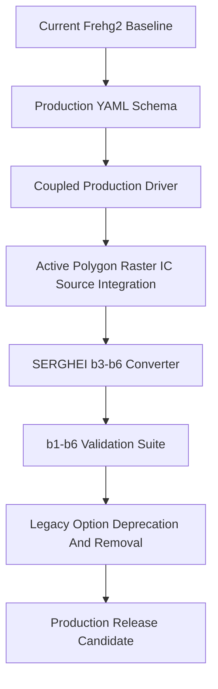

# Frehg2 Production Readiness Plan

## Current Baseline

Frehg2 has completed the planned architecture and feature upgrade through Phase 12, but it is not production-ready yet. The current executable in `src/main.cpp` is still a benchmark-oriented single-physics driver: it runs the SW path or the GW path based on YAML enable flags. Several Part 2 features are implemented as modules/utilities and covered by tests, but need full driver and solver-loop integration before they can replace legacy fields.

Key files to anchor the work:

- `src/main.cpp`: current executable driver and benchmark output path.
- `src/bc/BoundaryCondition.hpp`, `src/bc/Polygon.hpp`: polygon BC/source utilities.
- `src/coupling/Coupling.hpp`: synchronous and asynchronous coupling utilities.
- `src/core/InitialCondition.hpp`, `src/core/Monitor.hpp`: IC and monitoring utilities.
- `src/io/Config.hpp`: YAML flattening and path resolution.
- `benchmarks/b1-sw/b1-sw.yaml`, `benchmarks/b2-gw/b2-gw.yaml`: current regression benchmarks.
- `tests/compare_benchmarks.py`: existing legacy benchmark comparator.

## Development Flow

## Phase P13: Production Readiness Audit

Goal: freeze the actual production gap before changing behavior.

- Inventory every YAML field and classify it as active driver input, utility/test-only input, retained legacy mapping, or obsolete.
- Audit `src/main.cpp` to document exactly which fields are consumed for SW and GW runs.
- Audit b3-b6 SERGHEI inputs once they are available in the workspace.
- Define production acceptance criteria for b1-b6, including output variables, tolerances, and reference source.
- Produce `docs/production_readiness_audit.md` with a removal/deprecation candidate list.

Exit criteria:

- Clear list of legacy fields that must stay temporarily.
- Clear list of fields that can be removed only after production driver validation.
- Clear b3-b6 input inventory.

## Phase P14: Production YAML Schema V2

Goal: define the Frehg2 production input schema before wiring more code.

- Add a formal schema document for the production YAML structure.
- Separate legacy compatibility fields from production fields.
- Make polygon BC/source, raster inputs, flexible IC, soil maps, monitoring, and coupled-run controls first-class sections.
- Define path resolution rules for all external files relative to the YAML file.
- Define accepted enum strings for BC types, source/sink types, IC source types, output formats, and coupling mode.
- Keep b1/b2 legacy-compatible YAMLs during transition, but add production-style versions for comparison.

Proposed production sections:

- `simulation`
- `domain`
- `time`
- `modules`
- `surface_water`
- `groundwater`
- `coupling`
- `initial_conditions`
- `boundary_conditions`
- `sources`
- `soil`
- `solute`
- `monitoring`
- `output`
- `validation`

Exit criteria:

- `docs/production_yaml_schema.md` exists.
- b1 and b2 have production-schema variants that preserve current benchmark behavior.
- Legacy fields are marked as deprecated but not removed yet.

## Phase P15: Coupled Production Driver

Goal: replace the benchmark-only executable path with a general production driver while preserving b1/b2 regression runs.

- Refactor `src/main.cpp` into a small CLI entry point plus reusable run orchestration classes.
- Add a `SimulationDriver` or equivalent in `src/core/` that initializes enabled modules from YAML.
- Support SW-only, GW-only, and coupled SW+GW runs from the same driver.
- Initialize grid/domain/state once and pass consistent state into SWE, RE, coupling, monitoring, and output layers.
- Add timestep orchestration for:
  - SW-only fixed/semi-implicit stepping.
  - GW-only adaptive stepping.
  - Coupled async SW+GW stepping using `src/coupling/Coupling.hpp`.
- Preserve b1 and b2 output behavior as compatibility modes until new validation output is stable.

Exit criteria:

- `frehg2 benchmarks/b1-sw/b1-sw.yaml` still runs.
- `frehg2 benchmarks/b2-gw/b2-gw.yaml` still runs.
- A coupled SW+GW smoke test runs through the new driver.
- Existing CTest suite passes.

## Phase P16: Make Part 2 Inputs Operational In Solver Runs

Goal: move Part 2 features from tested utilities into the active production runtime.

- Wire polygon BC/source parsing into runtime configuration instead of test-only helper loading.
- Apply polygon surface BC/source terms inside the SWE step where they affect matrix assembly, water-surface state, or explicit source updates as appropriate.
- Apply polygon groundwater BC/source terms inside the RE boundary-condition and source/sink path, including top/head/flux cases.
- Wire `soil_map_file` and `soil_types` into runtime RE parameter construction.
- Wire flexible IC sections into SW and GW state initialization.
- Wire monitoring sections into runtime output, including point and polygon monitors.
- Add focused tests proving YAML-defined polygon/raster/IC inputs affect actual solver state, not only utility outputs.

Exit criteria:

- Production YAML polygon BC/source changes alter solver outputs in controlled tests.
- Soil map and multi-VG parameters are active in runtime RE simulations.
- Flexible ICs are active from YAML in runtime simulations.
- Monitoring outputs are generated during actual runs.

## Phase P17: SERGHEI b3-b6 Conversion Pipeline

Goal: convert new SERGHEI-style benchmarks into Frehg2 production YAML and input files.

- Add `scripts/serghei_to_frehg2.py` to convert SERGHEI-style input folders to Frehg2 case folders.
- Map SERGHEI rasters to Frehg2 ASCII raster inputs.
- Map SERGHEI polygon/extbc/source files to Frehg2 `boundary_conditions` and `sources` sections.
- Map SERGHEI initial conditions to Frehg2 `initial_conditions` sections.
- Map SERGHEI soil/material tables to Frehg2 `soil` and `groundwater.soil_types` fields.
- Map SERGHEI output/reference metadata into `validation` sections.
- For each b3-b6 case, generate:
  - `benchmarks/bN-*/bN-*.yaml`
  - `benchmarks/bN-*/polygons/`
  - `benchmarks/bN-*/rasters/`
  - `benchmarks/bN-*/timeseries/`
  - `benchmarks/bN-*/reference/` if available
  - `benchmarks/bN-*/README.md` describing the conversion assumptions

Exit criteria:

- b3-b6 converted cases exist in Frehg2 format.
- Each converted case has a documented mapping report.
- Missing Frehg2 features, if any, are explicitly listed per case.

## Phase P18: Unified b1-b6 Validation Suite

Goal: make validation repeatable and release-blocking.

- Extend `tests/compare_benchmarks.py` or add a new comparator that supports both Frehg legacy references and SERGHEI-style references.
- Add a benchmark runner script, likely `scripts/run_benchmarks.py`, that runs b1-b6 and writes outputs to predictable fresh directories.
- Compare SW variables, GW variables, coupled exchange diagnostics, monitor time series, and mass balance where references exist.
- Add validation metadata in each benchmark YAML so the runner knows expected variables and tolerances.
- Establish tiered acceptance:
  - b1/b2 legacy regression: strict numerical tolerance where algorithms are expected to match.
  - b3-b6 SERGHEI-style coupled cases: physically and numerically defined tolerances based on available reference solutions.
- Produce machine-readable validation summaries and human-readable reports.

Exit criteria:

- One command runs b1-b6 from fresh outputs.
- Reports clearly pass/fail each variable and case.
- Benchmark output path ambiguity is gone.
- Validation failure blocks release tagging.

## Phase P19: Legacy Option Deprecation And Removal

Goal: remove legacy options only after production replacements are proven.

Recommended order:

- First deprecate legacy fields in documentation and warnings.
- Add migration tooling that converts old fields to production sections.
- Replace b1/b2 canonical YAMLs with production-schema YAMLs once they reproduce accepted behavior.
- Remove legacy BC arrays only after polygon BC is the authoritative runtime path.
- Remove unused legacy solver options only after tests prove they are not consumed.
- Keep a `legacy_to_frehg2.py` converter if users still need Frehg1 input migration.

Likely removal candidates after validation:

- `surface_water.bc_type` once polygon surface BC fully replaces it.
- `groundwater.bc_type` once polygon/head/flux/drainage BC fully replaces it.
- Legacy location arrays such as `tide_locX`, `tide_locY`, `inflow_locX`, `inflow_locY` after polygon equivalents are canonical.
- Disabled algorithm flags such as `difuwave`, `use_subgrid`, `iter_solve`, and `post_allocate` if no production path supports them.
- Legacy file flags like `eta_file`, `uv_file`, `h_file`, and `wc_file` after `initial_conditions` replaces them.

Do not remove yet:

- Fields consumed by current b1/b2 validation.
- Fields needed by conversion scripts.
- Fields required for reproducing legacy references before production replacements pass.

Exit criteria:

- Production YAML is canonical.
- Legacy-field tests either removed or replaced by migration tests.
- b1-b6 validation still passes after removals.

## Phase P20: Production Release Candidate

Goal: prepare a release that can credibly be called production-ready.

- Run full CTest suite.
- Run b1-b6 validation from clean outputs.
- Run memory/leak checks where practical for PETSc/HDF5 object lifetimes.
- Run at least one MPI smoke test if MPI remains advertised.
- Update `README.md`, `docs/user_manual.md`, `docs/developer_manual.md`, and `docs/validation_report.md` to reflect production behavior.
- Add release notes that state exactly which Frehg1 and SERGHEI features are supported, deprecated, or intentionally excluded.
- Tag only after all release gates pass.

Release gates:

- Build passes with `gcc-15` and local dependencies.
- CTest passes.
- b1-b6 validation passes or documented tolerances are accepted.
- Production YAML examples run without legacy-only fields.
- Coupled SW+GW case runs through the production driver.
- Polygon/raster/IC/monitoring features are active in actual runs.

## Recommended First Implementation Slice

Start with the smallest production-readiness slice before touching legacy removal:

1. Add the production-readiness audit.
2. Define production YAML schema V2.
3. Refactor `src/main.cpp` into a production driver skeleton while preserving b1/b2 behavior.
4. Add one tiny coupled SW+GW smoke benchmark.
5. Only then begin b3-b6 SERGHEI conversion.

This avoids deleting legacy fields before Frehg2 has a validated replacement path.
